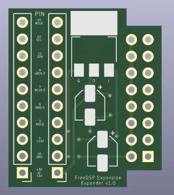

# freeDSP aurora expansion port extender and 3V3 PS

PCB to expand the freeDSP aurora expansion port with 3V3 regulator

## Contributing

**Please take care on which branch you're currently working!**

Branches:

- *master* - this branch always holds the latest released revision
- *develop* - this is the develop branch with new features. Please base your patches on this branch.

